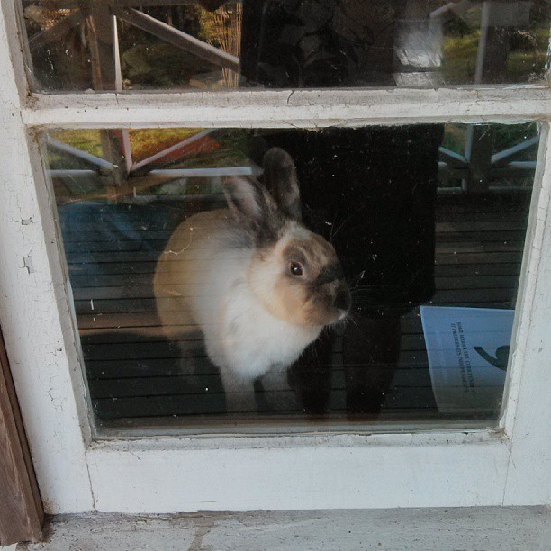

# Sigourney

Sigourney is a modular audio synthesizer.

It is mostly written in Go, with a thin layer of JavaScript to provide the UI.

## Installation

Sigourney has been developed under Mac OS X 10.9.
It may run on other platforms, but I can only vouch for this one.
In the future Sigourney should run on OS X, Linux, and Windows.

First, [install Go](http://golang.org/doc/install).
(Make sure you [set GOPATH](http://golang.org/doc/code.html).)

Second, install portaudio and portmidi.
I used [Homebrew](http://brew.sh/) to do this under OS X.

	$ brew install portaudio portmidi

Third, download (or update) and build Sigourney and its dependencies:

	$ go get -u github.com/nf/sigourney

## Usage

Run the `sigourney` binary (which should be in `$GOPATH/bin`) from the
repository root directory:

	$ cd $GOPATH/src/github.com/nf/sigourney
	$ $GOPATH/bin/sigourney

Then open http://localhost:8080/ in your web browser.
(I have only tested with Google Chrome.)

At this point you should see a page with an "engine" module in the middle
and a list of modules in the top right. Drag the "sin" module somewhere onto
the canvas. Then you can click to draw a connection from the "sin" module's
output to the "engine" module's input. At this point you should hear a 440hz
sine wave. If not, something is wrong.

### Control

* Drag a module to move it.
* Drag an output to an input to create a connection.
* Shift-click a module to delete it.
* Shift-click a connection to detach it.
* Drag the canvas to select multiple modules. With multiple modules selected:
  * Drag to move them.
  * Press `D` to duplicate them.
  * Press `Control-X` to delete them.

## Why "Sigourney"?

The project was originally named "gosynth" but a friend told me in no uncertain
terms that I needed a better name. Around that time, my pet rabbit Sigourney
died, and so I decided to honor her memory with this project.

I like the name because Sigourney liked to hang out in my studio and listen to
the music. (It's also convenient that it has "go" in it.)

## Credits

Sigourney was written by Andrew Gerrand <adg@golang.org> and is licensed under [Apache 2.0 license](LICENSE).

